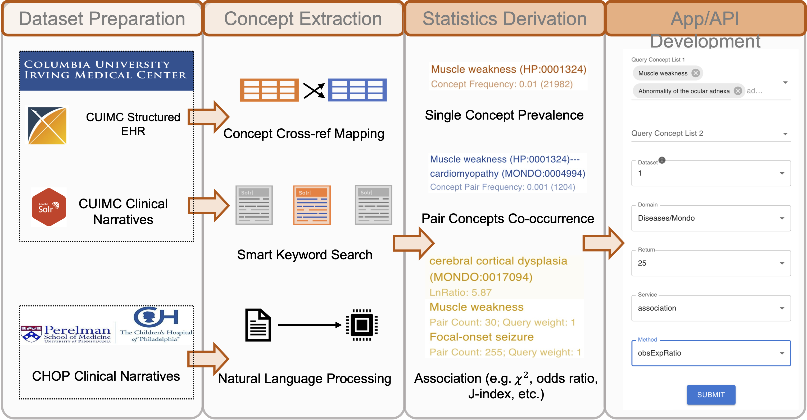

##  OARD (An acronym form of ["oh alright"](https://www.urbandictionary.com/define.php?term=oard)): an **O**pen real-world based **A**nnotation for **R**are **D**iseases and its associated phenotypes


This is a React web app to serve the web app of OARD. The backend is provided by OARD API. Currently it is hosted on the 
[NCATS AWS server (https://rare.cohd.io/)](https://rare.cohd.io/). This repo currenly only have the React web app part. The backend Flask API is hosted in another [repo](https://github.com/stormliucong/cohd-rare). We expect to merge two repos in the near future.

## An overview of OARD project


## How to use OARD
- [Use web app](./tutorial)
- [Use API ](https://rare.cohd.io/api)


## How to setup OARD
I followed this [article](https://blog.miguelgrinberg.com/post/how-to-deploy-a-react--flask-project) to setup up OARD as a flask API + React web app. 
### 1. Requirement

You need to install three packages on your machine:
* [Npm](https://docs.npmjs.com/) : The package manager for the Node JavaScript platform. 
* [Node.js](https://nodejs.org/en/): The JavaScript runtime that you will use to run your frontend project.
* You’ll need to have Node >= 14.0.0 and npm >= 5.6 on your machine.
* [Yarn](https://classic.yarnpkg.com/lang/en/docs/install/#mac-stable): A package and project manager for Node.js applications.

### 2. Installation on Ubuntu
```sh
git clone https://github.com/stormliucong/oard-react.git
cd oard-react
npm install # install dependencies
yarn build
```

### 3. Deploying on Nginx
Assuming you have your React application in the `/var/cohd-rare/oard-react` directory, change the **root** configuration in `/etc/nginx/sites-available/cohd-rare` to:
```sh
server {
    
        location / {
                root /var/cohd-rare/oard-react/build/;
                index index.html;
                try_files $uri $uri/ =404;
        }
        
}
```
