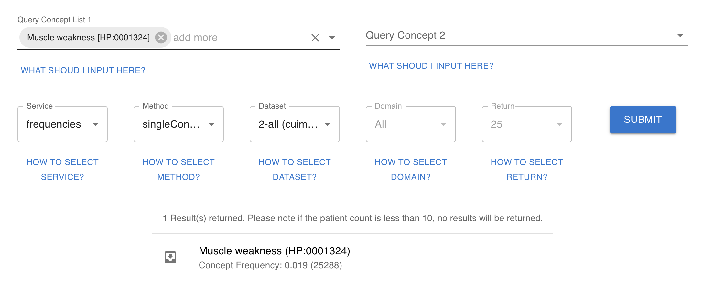
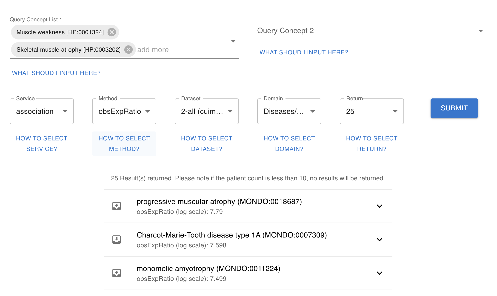
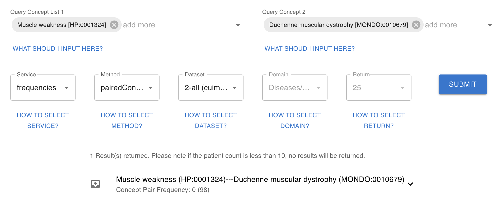
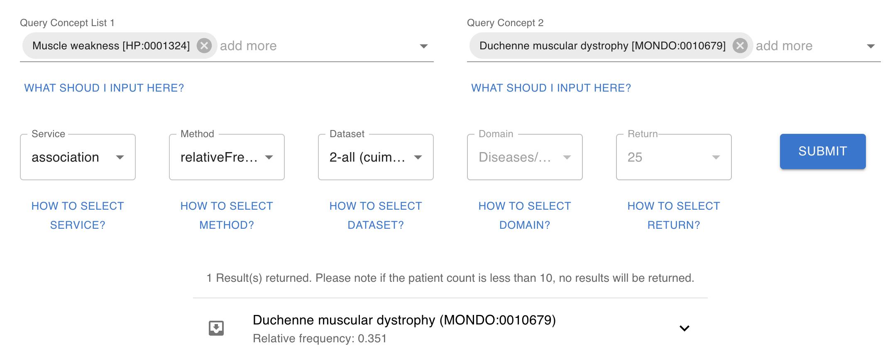

# OARD : An Open Real-world based Annotation for Rare Diseases and its Associated Phenotypes

## How to use OARD web application

### Input your concepts
- OARD can be used to query single concept frequency or paired concept frequency. The widgets will be automatically adjusted according to your input.
  - For single concept frequency, input the query concept in the first query box
    - You are allowed to pick more than one items;
    - If no input provided in the first box, the concept most frequently occurred will be returned;
  - For paired concept frequency (or association), input the query concept in both boxes; 
    - You are allowed to pick more than one items;
    - At least one concept is required in the first box;
    - If no inputs provided in the second box, the concept most frequently co-occurred (or most associated) with the first one will appear;

### Select your sevice/method
- There are two service provided by OARD, frequency or association.
  - Frequency works for a single concept or a paired concepts
  - Association only works for paired concepts
    - There are multiple options (statistics) available for association calculation;

### Select your dataset
- There are many datasets available to display the frequency or association information;
- They are classified according to clinical site, source, subpopulation; details can be found by clicking how to select dataset;
  - e.g. dataset 2 is compiled by extracting concepts from all clinical notes from CUIMC and generating a population-level concept frequency and co-occurrences (or association) for all cuimc populations
  - e.g. dataset 22 is compiled by extracting concepts from all clinical notes (when patient is in their teenage) from CUIMC and generating a population-level concept frequency and co-occurrences (or association) for all cuimc populations
  - e.g. dataset 199 is compiled by extracting concepts from all clinical notes from CUIMC, aggregating the concept by their hierachical position, and generating a population-level concept frequency and co-occurrences (or association) for all cuimc populations
  - e.g. datatset 190000707 is compiled by converting structured OHDSI database (mainly contains billing and lab codes) to HPO/MONDO concepts, and generating pulation-level concept frequency and co-occurrences (or association) for all cuimc populations having a phenotype related to "abnormality of the nervous system"

### Select your domain and return
- When in the mode of returning most frequency or most associated concepts, you can specific the domain of concepts you want to return; you can specify the number of hits you want to return

## Examples
### Example 1 - find single concept frequency for muscle weakness

### Example 2 - find most associated (ranked by obs/exp ratio) diseases with muscle weakness and skeletal muscle atrophy

### Example 3 - find co-occurrence frequency of a concept pair of muscle weakness and Duchenne muscular dystrophy

### Example 4 - find relative frequency of muscle weakness in duchenne muscular dystrophy patients

